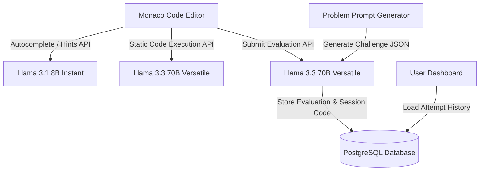

# AI Code Interviewer 🚀

A browser-based mock interview simulator that generates coding challenges on demand, watches you code in a Monaco editor, runs test code, and provides real-time intelligent hints and evaluation feedback.

Built with **Next.js**, **Tailwind CSS**, **Monaco Editor**, **Prisma ORM**, and the **Groq SDK** (hosting Llama 3 models).

---

## Key Features

1. **On-Demand Problem Generation** 🧠
   - Instantly generates custom LeetCode-style coding challenges (Easy, Medium, Hard) across various languages (JavaScript, TypeScript, Python, Java, C++) using `llama-3.3-70b-versatile`.
2. **Professional Monaco Code Editor** 💻
   - Integrated Monaco editor featuring custom autocomplete, inline suggestions, syntax highlighting, bracket matching, and a code reset handler.
3. **Simulated Sandboxed Code Execution** 🖥️
   - Run code dynamically in a simulated execution panel. Statically executes code in an LLM-sandboxed sandbox, reporting `stdout` and `stderr` output.
4. **Smart, Non-Spoiling Hint Engine** 💡
   - Leverages `llama-3.1-8b-instant` to deliver conceptual hints or autocomplete recommendations when you are stuck, without ruining the challenge.
5. **Detailed Performance Evaluation** 📊
   - Submits code for multi-dimensional evaluation, providing a grade score (0-100), time/space complexity analysis, identifying issues, listing improvement recommendations, and offering a verdict.
6. **Attempts & Progress Dashboard** 📈
   - Fully persistent tracking of sessions, completion status, language usage, scores, and past evaluation reviews via PostgreSQL and Clerk Authentication.

---

## Tech Stack

- **Frontend Framework**: [Next.js](https://nextjs.org/) (App Router, React 19)
- **Editor**: [@monaco-editor/react](https://www.npmjs.com/package/@monaco-editor/react)
- **Styling**: [Tailwind CSS](https://tailwindcss.com/) & [Lucide Icons](https://lucide.dev/)
- **State Management**: [Zustand](https://github.com/pmndrs/zustand)
- **Database ORM**: [Prisma](https://www.prisma.io/)
- **Database**: PostgreSQL (Prisma Client)
- **Authentication**: [Clerk](https://clerk.com/)
- **AI Core**: [Groq SDK](https://github.com/groq/groq-sdk) (`llama-3.3-70b-versatile`, `llama-3.1-8b-instant`)

---

## Architecture Flow



---

## Local Setup & Development

Follow these steps to run the application locally:

### 1. Prerequisites
- Node.js (v18+ recommended)
- A PostgreSQL database instance
- A Groq Cloud API Key
- A Clerk Authentication App Set up

### 2. Environment Variables Configuration
Create a `.env` (or `.env.local`) file in the root directory:

```env
# Database Connections
DATABASE_URL="postgresql://<user>:<password>@<host>:<port>/<db>?sslmode=require"
DIRECT_URL="postgresql://<user>:<password>@<host>:<port>/<db>?sslmode=require"

# Clerk Authentication Keys
NEXT_PUBLIC_CLERK_PUBLISHABLE_KEY="pk_test_..."
CLERK_SECRET_KEY="sk_test_..."

# Groq Cloud AI Keys
GROQ_API_KEY="gsk_..."
```

### 3. Install Dependencies
```bash
npm install
```

### 4. Setup database schemas (Prisma Migrate/Generate)
```bash
npx prisma generate
npx prisma db push
```

### 5. Run the Dev Server
```bash
npm run dev
```

Open [http://localhost:3000](http://localhost:3000) with your browser to experience the platform!

---

## Key Files & Structure

```text
├── app/
│   ├── api/                 # Next.js Route Handlers for LLM integration
│   │   ├── autocomplete/    # Inline code autocomplete recommendations
│   │   ├── evaluate/        # Session correctness evaluation
│   │   ├── execute/         # Static sandboxed code executor
│   │   ├── hint/            # Context-aware mock interviewer hints
│   │   ├── history/         # Fetch past session dashboard logs
│   │   └── session/         # Session initiator & problem generator
│   ├── interview/           # Main simulation workspace pages
│   ├── layout.tsx           # Global Root layout (Theme & Auth provider wrappers)
│   └── page.tsx             # Interactive dashboard and launcher landing page
├── components/              # Modular UI blocks (Editor, Hint, Problem, Modals)
├── lib/                     # System Prompt Definitions & ORM clients
├── prisma/                  # Database Schemas (User, Session, Evaluation models)
└── store/                   # Zustand Interview State management
```
